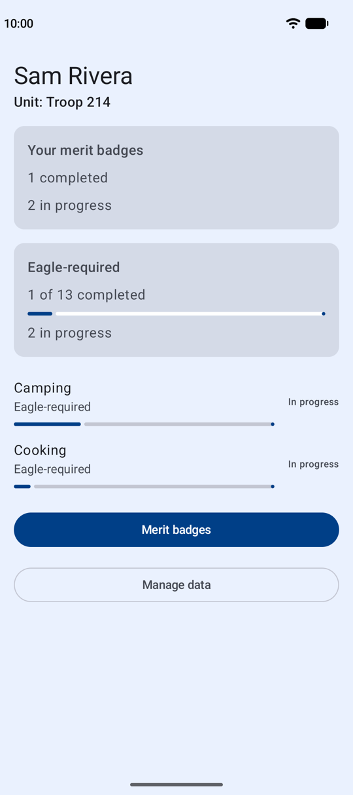
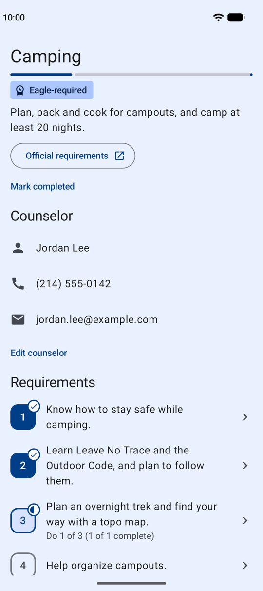
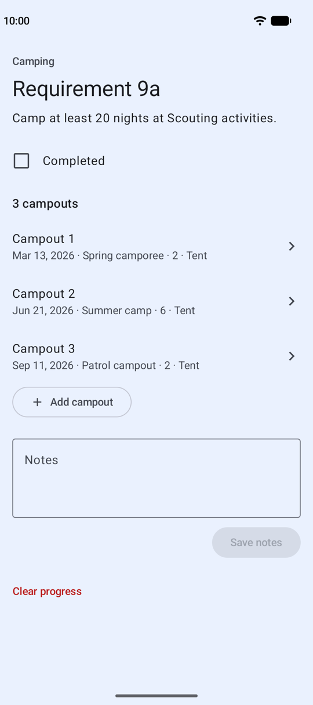

# BlueCard

[](https://github.com/bryancassell/bluecard/actions/workflows/ci.yml)

An Android app for Scouting America scouts to track their progress on merit badges.

With BlueCard, a scout can:

- Browse and search the merit badges, each with a short summary and a link to
  its official requirements.
- Record their counselor's contact details, and a completion date and notes for
  each requirement.
- Fill in the logs some requirements need, such as Personal Fitness's 12-week
  exercise log.
- Mark a badge completed on an earlier date, without entering each requirement.
- Save or share a PDF report of everything recorded for a completed badge.
- Export their progress to a file, and import it again on another phone.

There's no account or server. Progress is stored on the phone, and the app
itself doesn't connect to the internet: links to official pages open in the
browser.

<p>
  
  
  
</p>

## Status

BlueCard is in development and hasn't been released yet. The catalog doesn't
include every merit badge yet.

## Supported devices

BlueCard runs on Android 8.0 (API 26) and newer.

## Building

You need Android Studio and the Android SDK it installs. You don't need to
install Gradle, Kotlin or a separate JDK. The steps are in
[One-time machine setup](docs/toolchain.md#one-time-machine-setup-macos).

Then, from the repository root:

```sh
./gradlew build         # Builds the app and runs every check CI runs
./gradlew installDebug  # Installs the debug app on a running emulator or phone
```

You can also open the project in Android Studio and run the `app` configuration.
The other commands are listed in
[Everyday commands](docs/toolchain.md#everyday-commands).

## Documentation

| Document | What's in it |
|---|---|
| [`PRD.md`](PRD.md) | What the app does, and the decisions about how it looks and behaves |
| [`ARCHITECTURE.md`](ARCHITECTURE.md) | How the app is built, and the conventions new code follows |
| [`docs/toolchain.md`](docs/toolchain.md) | Machine setup, build commands, and the testing rules the build checks |
| [`docs/catalog.md`](docs/catalog.md) | How to add merit badges and requirements to the catalog |

## Disclaimer

BlueCard is an independent project. It is not affiliated with or endorsed by
Scouting America.

## License

BlueCard is released under the [MIT License](LICENSE).
